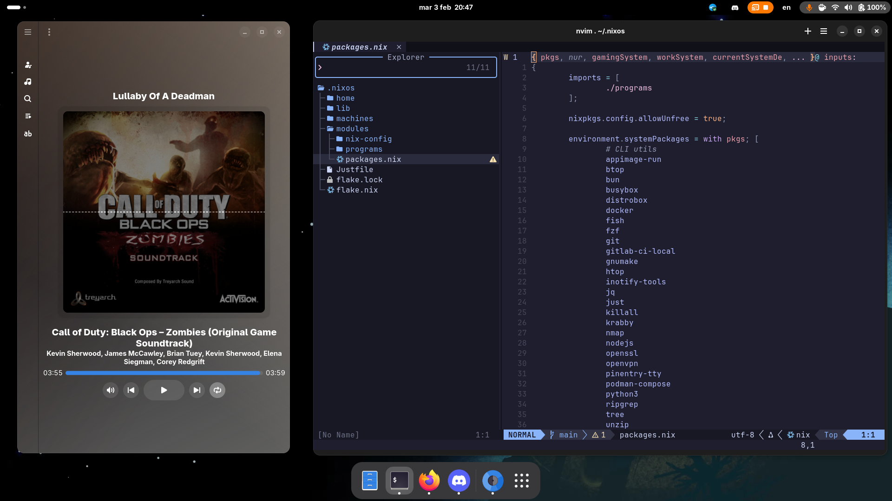

# NixOS configuration 

My own NixOS configuration, made for myself so probably won't suit you well.



## How to install 
1) Clone the repo
```bash
git clone git@github.com:Superredstone/nixos.git ~/.nixos && cd .nixos
```
2) Choose an hostname 
3) Copy your current configuration inside of `machines/$HOSTNAME`
4) Create a file named `machines/$HOSTNAME/default.nix` with the following contents 
```nix
{ ... }: 
{
	imports = [
		./configuration.nix
	];
}
```
5) Switch to the new configuration
```bash
HOSTNAME=HOSTNAME just switch
```

